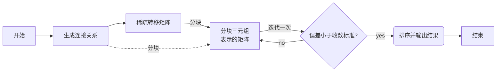
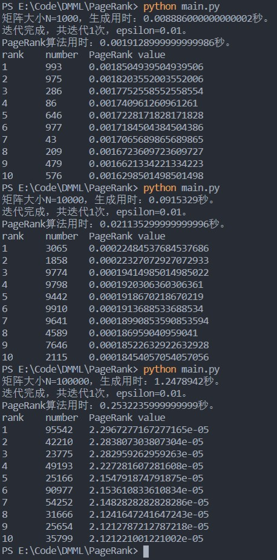
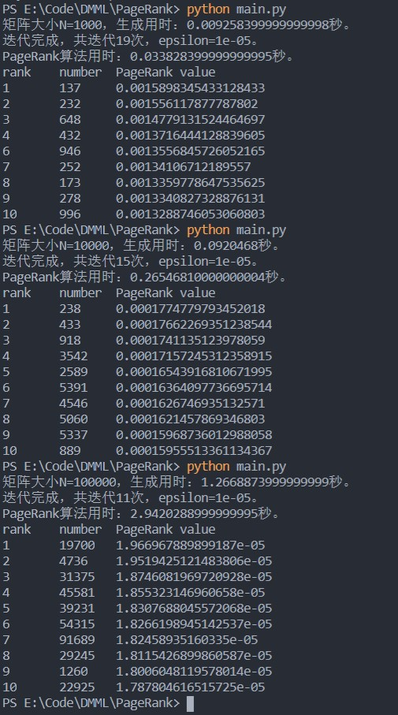
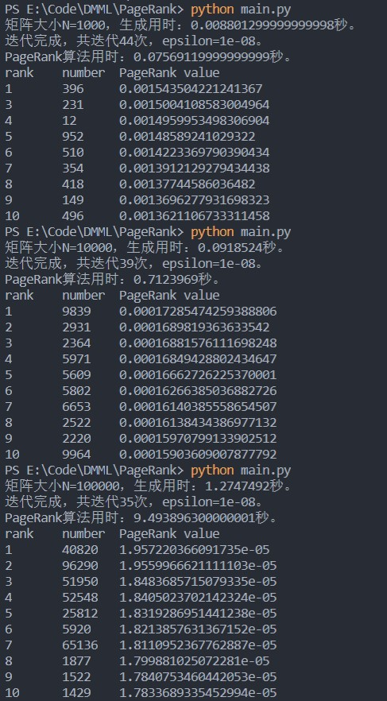
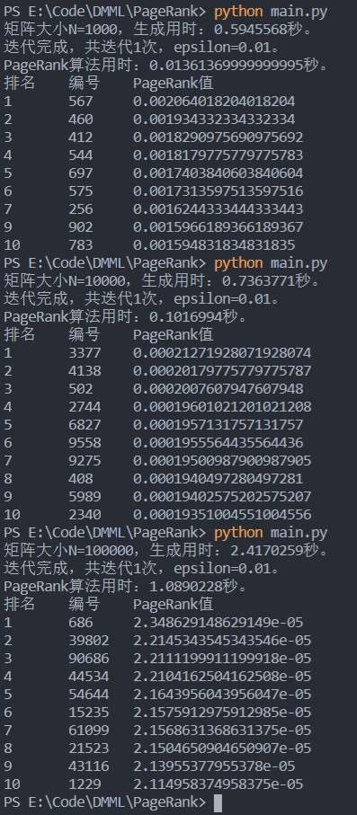
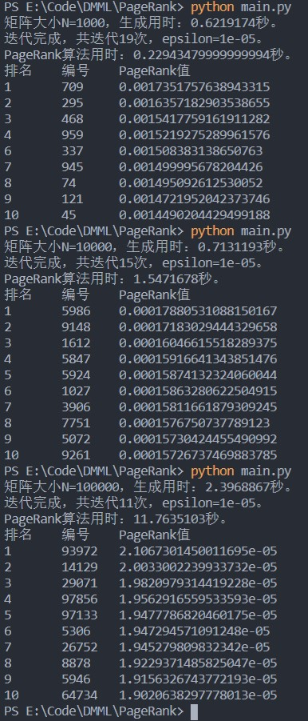
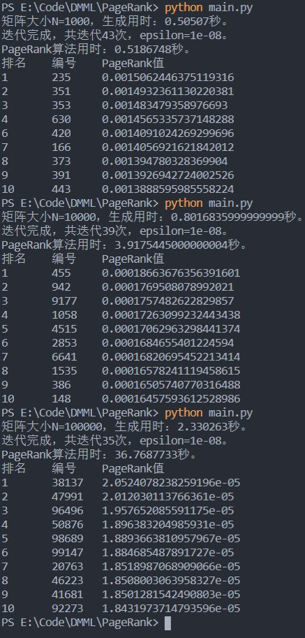

# PageRank实验报告

项目 GitHub 地址：https://github.com/MxEmerson/PageRank

基本功能和扩展功能分别位于 master 与 sqlite 分支。

## 1.算法设计思路

PageRank，即网页排名，是 Google 创始人拉里·佩奇和谢尔盖·布林于1997年构建早期的搜索系统原型时提出的链接分析算法。算法的基本思想是：若网页 A 存在一个指向网页 B 的链接，则表明 A 的所有者认为 B 比较重要，从而把一部分的重要性得分赋予 B，而 B 的 PageRank 值为一系列类似于 A 的页面重要性得分值的累加。所有网页的 PageRank 值通过转移矩阵的迭代得到。

**根据实现要求，算法的具体设计思路如下：**  

- 在6-15中随机取一个整数，作为对应网页的出度，然后选取出度数量的网页编号作为对应结点指向的网页编号组，生成N行格式为 `(src,degree,[dest1,...])` 的三元组。由于每个节点都存在出度，所以该矩阵不存在 dead ends。
- 将三元组形式的迁移矩阵进行分块，必须至少分为两块。
- 遍历分块的三元组迁移矩阵，对相应的 rank 值进行累加。为防止 spider trap，需要通过随机转移概率 $1 - \beta$ 进行调整。
- 进行迭代，直到误差小于设置的收敛标准。误差计算即为求新旧 rank 向量的的差的模。
- 输出算法总时间、迭代次数以及 PageRank 值最大的10个网页编号与对应的 PageRank 值。

## 2.算法流程图



## 3.关键代码描述

`matrix.py` 中的代码封装了矩阵乘法，包括矩阵相乘和数乘矩阵。后续开发中直接生成了三元组矩阵，并未用到以下代码。

矩阵相乘函数：首先判断行列相等情况，然后初始化C的行数和列数分别等于A的行数和B的列数，接着进行A、B矩阵乘法，最后返回C。

```python
class Matrix:
    ...
    def __mul__(self, B):
        """
        重载乘法运算符，用于矩阵乘矩阵
        """
        if self.col != B.row:
            return Matrix(1, 1)
        C = Matrix(self.row, B.col)
        for i in range(C.row):
            for j in range(C.col):
                for p in range(B.row):
                    C[i][j] += self.A[i][p] * B[p][j]
        return C
```

数乘矩阵函数:对矩阵的每个元素进行数乘运算。

```python
class Matrix:
    ...
    def __rmul__(self, B):
        """
        反向重载乘法运算符，用于数乘矩阵
        """
        for i in range(self.row):
            self.A[i] = list(map(lambda x: x*B, self.A[i]))
        return self
```

`generator.py` 中的代码生成原始的稀疏迁移矩阵和三元组分块表示的稀疏矩阵。

`matrix` 为 N 行的原始三元组稀疏迁移矩阵，下面的代码进行分块：`part_size` 为每个分块的大小，`part_num` 为分块数，`m[2][i]` 表示 `matrix` 第 `m` 个网页所指向的第 `i` 个网页编号，`part` 为分块表示的迁移矩阵。

```python
    for m in matrix:
        left = 0
        old_seq = m[2][0] // part_size
        for i in range(len(m[2])):
            new_seq = m[2][i] // part_size
            if old_seq != new_seq:
                new_m = (m[0], m[1], m[2][left:i])
                part[old_seq].append(new_m)
                if new_seq == part_num - 1:
                    new_m = (m[0], m[1], m[2][i:])
                    part[new_seq].append(new_m)
                    break
                else:
                    left = i
                    old_seq = new_seq
```

计算误差函数：采用rank向量差的模进行表示。

```python
def error(rank: list, last: list) -> float:
    """计算r_new与r_old差的模，即停止条件"""
    mysum = sum(list(map(lambda x: (x[0]-x[1])**2, zip(rank, last))))
    mysum = math.sqrt(mysum)
    return mysum
```

下面的代码进行 PageRank 值的计算：`M` 是迁移矩阵，`step` 是分块大小，为防止 spider trap，需要在累加完毕后加上随机转移概率。

```python
    while True:
        rnew = [0 for i in range(N)]
        pointer = 0
        for m in M:  # 遍历每个分块
            for line in m:  # 查询该分块的每一行
                for j in line[2]:  # 遍历每行dest字段包含的节点
                    rnew[j] += rank[line[0]]/line[1]  # 对r_new进行累加
            pointer += step
        # r_new乘beta再加(1-beta)/N，防止spider trap
        rnew = list(map(lambda x: x*beta + (1 - beta)/N, rnew))
        iterations += 1
        if error(rnew, rank) < epsilon:  # 判断收敛条件
            rank = rnew
            break
        rank = rnew  # 更新rank值
```

## 4.实验结果

设置三个收敛标准，取 N=1000,10000,100000，分块数为10的实验结果：

| epsilon=0.01 | epsilon=1e-5 | epsilon=1e-8 |
| :----: | :----: | :----: |
|  |  |  |

当 N=1000000 时，算法用时可接受，内存使用最大为 1200MB 左右。


## 5.实验分析

从实验结果图可以看出，当收敛标准为 1e-2 时，只需要一次迭代，生成矩阵的时间约为迭代用时的四到五倍，算法整体耗时主要在生成矩阵上面；当收敛标准变为 1e-5 时，迭代次数在 10 到 20 次之间，迭代的用时就超过生成矩阵的用时；当收敛标准达到 1e-8 时，迭代次数达到30次以上，迭代占了算法用时大部分的时间。因此，当收敛标准较严时，主要需改进迭代算法；当收敛标准较松时，主要需改进生成矩阵算法。在同一收敛标准下，迭代次数随 N 增加而减少。时间复杂度为 $O(cn^2)$,其中 $c$ 为迭代次数，$n$ 为节点个数。

同时，实验提示当矩阵规模增长时，迭代耗时和内存消耗也会成倍增长。虽然 N=100000 甚至 N=1000000 的矩阵规模对现代 PC 来说可以接受，但更大的矩阵对一些计算机来说就变得难以接受了。此外，由于全局解释锁的存在，python 并不原生支持多线程，这无疑也使程序运行效率大打折扣。

## 6.扩展优化

在实现以上基础功能的前提下，我们对其进行了进一步的优化。由于 python 标准库包含 sqlite 和 多进程相关包，故我们使用 sqlite3 和 multiprocess 库对源代码进行了改写，以处理内存不足和无法利用多核处理器的情况。相关代码见 GitHub 仓库的 sqlite 分支。

### 利用 sqlite 存储矩阵

Python3 将 sqlite3 纳入了标准库。设计存储三元组表示的矩阵的表结构如下：

```SQL
CREATE TABLE part
    (part_num INT NOT NULL,
        src INT NOT NULL,
        degree INT NOT NULL,
        dest TEXT NOT NULL,
        PRIMARY KEY(part_num, src));
```

相比基础方案，我们不再提前生成稀疏矩阵，而是直接生成三元组表示的矩阵并分块后存入数据库。计算 PageRank 时，查询每个分块对应的数据库/表并进行累加即可。

### 利用多进程加速矩阵生成

由于 sqlite3 并不支持表级锁，故只能使用多进程操作多个数据库的方式来加速矩阵生成。关键代码如下：

```python
def main():
    N = 1000000
    part_count = 10
    ps = []
    for i in range(part_count):
        p = Process(target=generator, args=(i*(N//part_count),
                    (i+1)*(N//part_count), N, (N//part_count)))
        ps.append(p)
    for i in range(part_count):
        ps[i].start()
    for i in range(part_count):
        ps[i].join()
```

由于使用的是6核12线程的 CPU，故默认将矩阵分为10块，用10个进程执行。

代码运行的最终效果如下：

| epsilon=0.01 | epsilon=1e-5 | epsilon=1e-8 |
| :----: | :----: | :----: |
|  |  |  |

经测试，支持N=100000000级别矩阵的生成，用时约20分钟。

### 未完成的优化

当矩阵规模过大以至于 rank 值也无法全部保存在内存中时，需要设计表结构并将 rank 值也存入数据库中。但当矩阵规模超过一亿时，一张表存一亿行数据会导致查询效率较低，因此还涉及分表（使用多进程时，对于sqlite来说需要分库）操作。

另外，累加操作也可以使用多进程来加速，不过这涉及到进程间同步和通信，对于 python 来说较为复杂。
